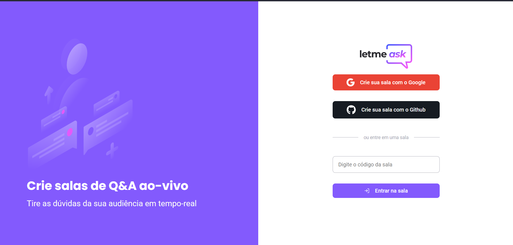
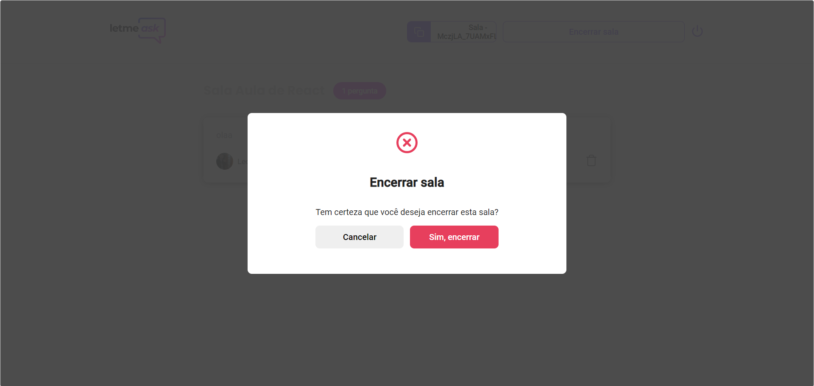

# Esse projeto foi feito durante a NLW - 6

## 🚀 Novas funcionalidades

- Uso do Formik para gereniar formulários e validação com Yup.
- Uso de Styled Components | uso de variáveis
- Criação do Modal com react-modal
- Login com o Github
- Componente de Private Route do Firebase
- Logout da aplicação
- Implementação de toast messages | react-notifications-component

<h1 align="center">
    
</h1>

## Funcionalidaded do Modal

<h1 align="center">
    
</h1>

 
 
## 🚀 Techs

- [React](https://reactjs.org)
- [Firebase](https://firebase.google.com/)

## Link do projeto: https://letmeask-nlw6-hv66xyx8l-leonardoprimieri.vercel.app/
